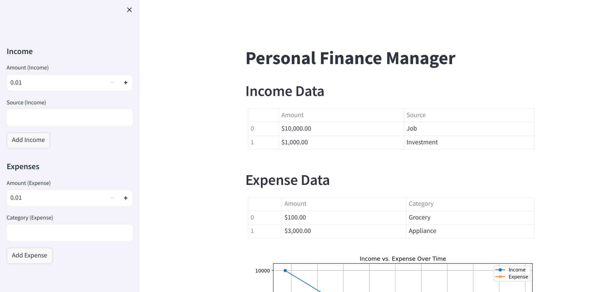
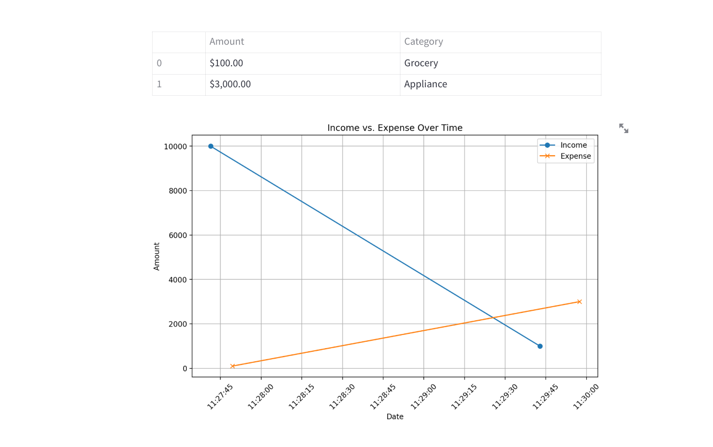

# Personal Finance Manager




## Overview

The Personal Finance Manager is a simple Python application built with Streamlit and SQLAlchemy to help users track their income and expenses. This README provides an overview of the project, its features, and instructions for running it on your local machine.

## Features

- **Income Tracking**: Record your income entries, including the amount, source, and date.
- **Expense Tracking**: Record your expense entries, including the amount, category, and date.
- **Data Visualization**: Visualize income and expense data over time using line charts.
- **Currency Formatting**: Display amounts in a user-friendly currency format.
- **Data Persistence**: Store your financial data in an SQLite database.

## Getting Started

### Prerequisites

Before you begin, ensure you have Python and the required libraries installed. You can install the libraries using pip:

```bash
pip install streamlit sqlalchemy
```

## Usage
- Launch the app by running the Streamlit command as mentioned in the installation section.
- Use the sidebar to add your income and expense entries.
- The income and expense data will be displayed in tables.
- A line chart at the bottom of the page visualizes the trend of your income and expenses over time.
- Currency formatting is applied to the amounts in the tables and charts.